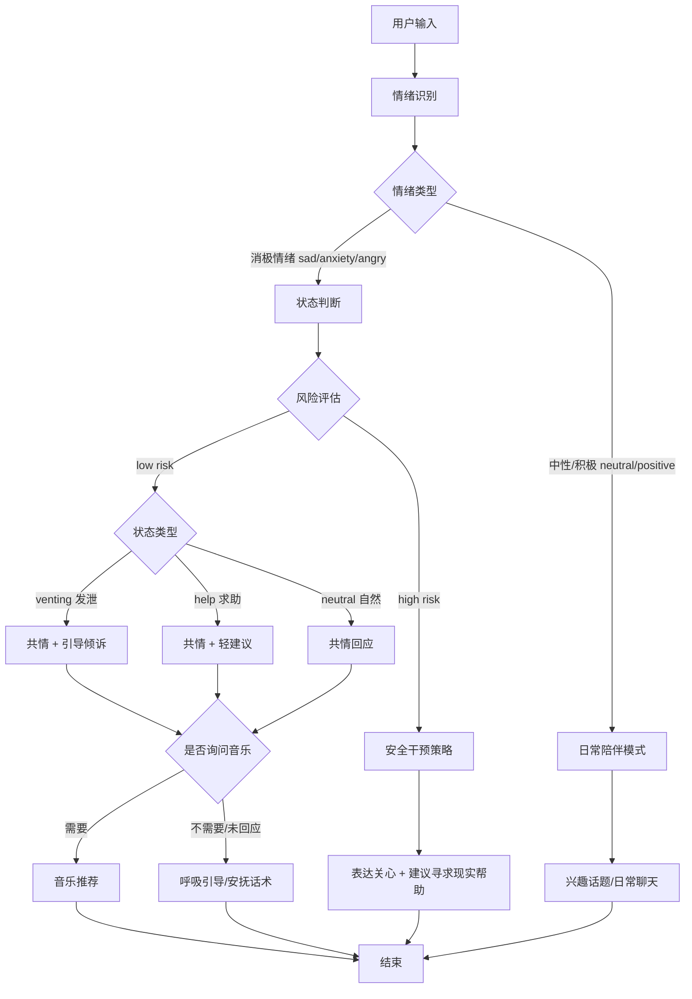
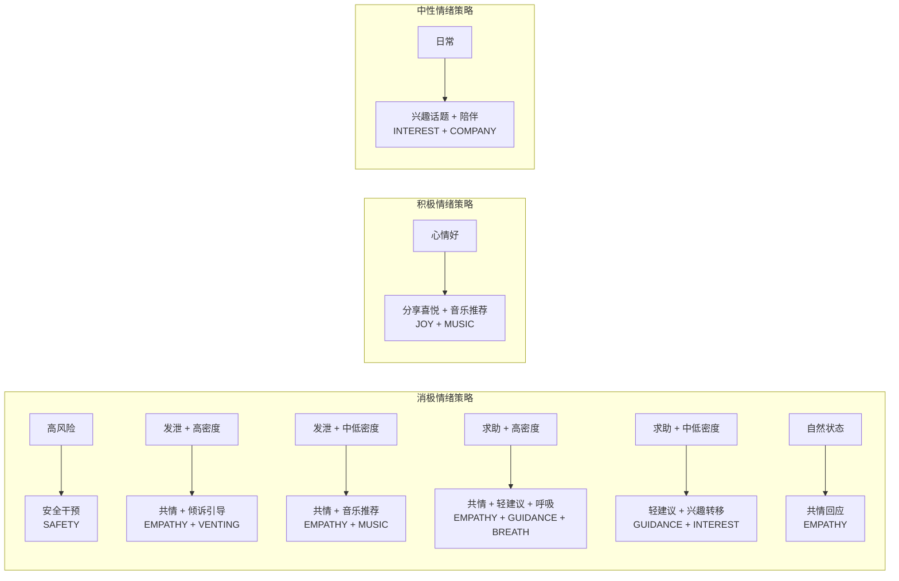
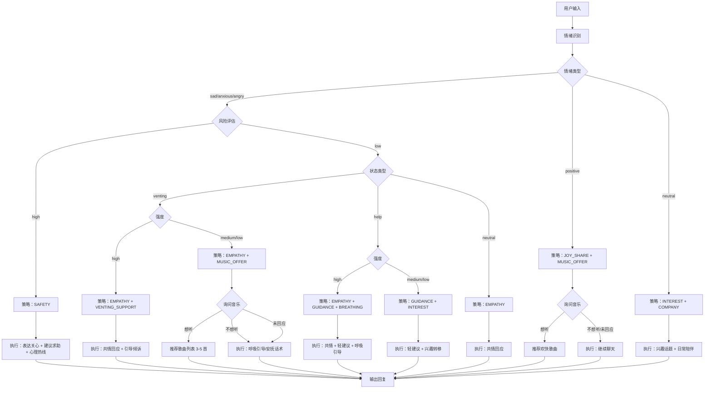
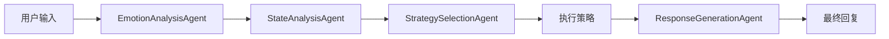
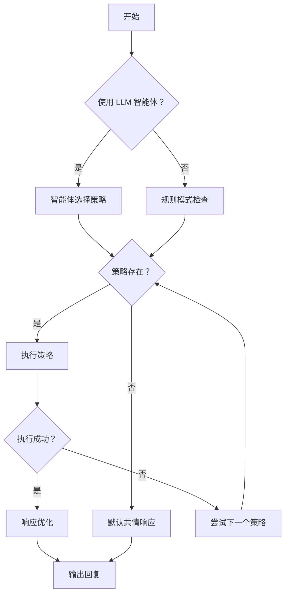

# 情感陪伴策略系统

## 整体流程



---

## 模块 1：状态判断

### 输入
```json
{
  "text": "用户输入",
  "emotion": "sad / angry / anxiety / neutral / positive"
}
```

### 输出
```json
{
  "stage": "venting / help / neutral",
  "intensity": "low / medium / high",
  "risk": "low / high"
}
```

### 判断标准

| 维度 | 类型 | 判断依据 |
|------|------|----------|
| **stage** | venting | 表达情绪、抱怨、感叹，不求建议 |
| | help | 询问"怎么办"、"怎么做"、求建议 |
| | neutral | 平静叙述、日常聊天 |
| **intensity** | low | 情绪词少、语气平缓 |
| | medium | 有明显情绪词、感叹号 |
| | high | 强烈情绪词、重复表达、多个感叹号 |
| **risk** | high | 出现"不想活"、"活着没意义"、"想死"、"绝望"等 |
| | low | 无风险词汇 |

---

## 模块 2：策略选择矩阵



### 策略决策表

| 情绪 | stage | intensity | risk | 策略组合 |
|------|-------|-----------|------|----------|
| sad/anxious/angry | - | - | high | SAFETY |
| sad/anxious/angry | venting | high | low | EMPATHY + VENTING_SUPPORT |
| sad/anxious/angry | venting | medium/low | low | EMPATHY + MUSIC_OFFER |
| sad/anxious/angry | help | high | low | EMPATHY + GUIDANCE_LIGHT + BREATHING |
| sad/anxious/angry | help | medium/low | low | GUIDANCE_LIGHT + INTEREST_REDIRECT |
| sad/anxious/angry | neutral | - | low | EMPATHY |
| positive | - | - | low | JOY_SHARE + MUSIC_OFFER |
| neutral | - | - | low | INTEREST_TOPIC + COMPANY |

---

## 模块 3：策略详细说明

### 3.1 安全干预策略 (SAFETY)
**触发条件**: risk = high

**执行要点**:
- 表达关心和担忧
- 不评判、不说教
- 建议寻求现实帮助（家人、朋友、专业机构）
- 提供心理援助热线信息
- 不主动询问音乐
- 识别重度症状，建议专业干预

**风险等级识别**:

| 风险信号 | 程度 | 应对方式 |
|----------|------|----------|
| "活着没意思" | 中度 | 共情 + 建议找人聊聊 |
| "不想活了" | 高度 | 强烈建议专业帮助 + 提供热线 |
| "想死" | 高度 | 强烈建议专业帮助 + 提供热线 |
| 有具体计划 | 紧急 | 建议立即就医/联系家人 |
| 幻觉/妄想 | 紧急 | 建议立即就医 |

**示例话术**:

**中度风险**（情绪低落但无自伤念头）:
```
听到你这样说，我有点担心你现在的状态
这种感觉一定很不好受

你不需要一个人扛着这些，可以考虑找一个信任的人聊聊
或者联系专业的支持渠道

如果你愿意，也可以和我多说一点，我在这里听你
```

**高度风险**（出现轻生念头）:
```
听到你这样说，我真的很担心你
这种感觉一定非常难受，让你有了这样的想法

你不需要一个人扛着这些
可以考虑找一个信任的人聊聊，或者联系专业的支持渠道

全国心理援助热线：400-161-9995（24 小时）
北京市心理援助热线：010-82951332
希望 24 热线：400-161-9995

如果你愿意，也可以和我多说一点，我在这里听你
```

**紧急情况**（有具体计划/幻觉妄想）:
```
我很担心你现在的安全
这种感觉一定让你很痛苦

请你现在就联系一个信任的人，比如家人、朋友
或者马上去医院看看

全国心理援助热线：400-161-9995（24 小时）

你不是一个人，有人愿意帮助你
如果你愿意，也可以和我多说一点，我在这里听你
```

---

### 3.2 共情策略 (EMPATHY)
**触发条件**: 所有消极情绪状态

**执行要点**:
- 先理解和接纳情绪
- 复述用户感受（不编造细节）
- 正常化情绪反应
- 避免"你应该"式说教
- 根据情绪类型调整共情重点

**共情重点选择**:

| 情绪类型 | 共情重点 | 示例 |
|----------|----------|------|
| sad 悲伤 | 承认丧失的痛苦 | "失去亲人/朋友，这种痛苦难以言喻" |
| anxiety 焦虑 | 理解担忧的感受 | "担心是正常的，换做是谁都会这样" |
| angry 生气 | 认可情绪的合理性 | "遇到这种事，生气是很正常的" |
| 孤独感 | 表达陪伴意愿 | "我在这儿陪着你，你不一个人" |
| 无助感 | 肯定已做的努力 | "你已经很努力了，这不容易" |

**示例话术**:

**悲伤共情**:
```
听起来你真的有点疲惫和失落
好像是付出了很多，但结果却没有回应
这种落差其实挺打击人的
换做是谁都会不好受
```

**焦虑共情**:
```
能感觉到你现在很担心
这种事情确实让人心里不踏实
你愿意多说说是因为什么担心吗？
```

**愤怒共情**:
```
遇到这种事，生气是很正常的
换做是我，可能也会不高兴
你心里一定很不好受
```

**孤独感共情**:
```
一个人在家，有时候确实会觉得冷清
想找人说话的时候找不到人
我在这儿陪着你，你想聊什么都可以
```

---

### 3.3 引导倾诉策略 (VENTING_SUPPORT)
**触发条件**: stage = venting

**执行要点**:
- 表达愿意倾听
- 用开放式问题引导
- 不急于给建议
- 给用户表达空间
- 根据倾诉内容选择跟进方法

**跟进方法选择**:

| 倾诉内容 | 推荐方法 | 选择理由 |
|----------|----------|----------|
| 回忆往事 | 回忆锚定法 | 引导到积极记忆 |
| 抱怨现状 | 日常掌控清单 | 重建控制感 |
| 担忧健康 | 5-4-3-2-1 感官着陆 | 拉回当下，减少灾难化 |
| 思念亲人 | 情绪日记建议 | 帮助梳理情感 |
| 纯粹发泄 | 倾听 + 共情 | 满足表达需求即可 |

**示例话术**:

**通用引导**:
```
你愿意多说说最近发生了什么吗？
我在这儿听着呢
把事情说出来，心里可能会轻松一点
```

**回忆往事跟进**:
```
你刚才说以前……那段时光听起来很美好
要不要多跟我讲讲那时候的事？
说说你记得最清楚的是什么？
```

**担忧健康跟进**:
```
你担心身体，这种心情我能理解
有时候越想越害怕，反而更紧张
咱们先不想那么多，说说你现在感觉怎么样？
有没有哪里不舒服？
```

**思念亲人跟进**:
```
听你这么说，你很想他/她吧
要是愿意的话，可以跟我讲讲他/她的事
你们在一起的时候，有什么开心的回忆？
```

---

### 3.4 轻建议策略 (GUIDANCE_LIGHT)
**触发条件**: stage = help

**执行要点**:
- 只给 1 个简单可行的建议
- 不用专业术语
- 语气温和，不强迫
- 结尾保持开放
- 根据问题类型选择建议方法

**建议方法选择**:

| 问题类型 | 推荐方法 | 选择理由 |
|----------|----------|----------|
| 怎么办/如何做 | 认知重构三问 | 帮助理清思路 |
| 情绪困扰 | 呼吸法 + 感官着陆 | 先平复情绪再解决问题 |
| 缺乏动力 | 微小成就清单 | 从小事开始恢复行动力 |
| 睡眠问题 | 睡眠卫生习惯 | 基础改善最有效 |
| 孤独/无聊 | 兴趣话题 + 日常掌控 | 重建生活规律 |
| 担忧健康 | 阳光暴露法 + 散步 | 生理 + 心理双重调节 |

**示例话术**:

**认知重构三问**（决策困难）:
```
也许可以先想清楚你最在意的是什么
这样会更容易做决定

你可以问问自己：
- 有什么证据支持你的担心？
- 最坏的结果是什么？是不是也没那么可怕？
- 现在能做点什么让情况好一点？

你现在更担心的是哪一部分？
```

**呼吸法建议**（情绪困扰）:
```
心里烦的时候，可以先做几个深呼吸
不用想那么多，先让自己平静下来
平静了之后，再看怎么解决问题

要不要现在就试试？
```

**微小成就建议**（缺乏动力）:
```
有时候不想动，就从最小的事开始
比如：
- 起床叠好被子
- 喝一杯温水
- 下楼走 5 分钟
做完一件，心里会轻松一点
你今天想试试哪个？
```

**睡眠建议**（睡眠问题）:
```
睡不好的话，可以试试：
- 每天固定时间睡觉起床
- 睡前 1 小时别看手机
- 卧室暗一点，安静一点

你平时几点睡觉呀？
```

---

### 3.5 音乐推荐策略 (MUSIC_OFFER)
**触发条件**: 
- 消极情绪 + venting 中低密度
- 积极情绪（任何强度）

**执行要点**:
- **必须先询问**，不能直接播放
- 根据情绪状态推荐不同类型
- 推荐老年人熟悉的歌曲类型

**询问话术**:
```
消极情绪时：
"要不要听点舒缓的音乐？有时候音乐能让人放松一点"
"我这儿有几首比较温柔的老歌，你想听吗？"

积极情绪时：
"心情这么好，要不要放点你喜欢的歌助助兴？"
"想不想听点音乐？我可以根据你的喜好推荐几首"
```

**老年人歌曲推荐列表**:

| 情绪状态 | 推荐类型 | 示例歌曲 |
|----------|----------|----------|
| sad 悲伤 | 舒缓、温暖 | 《月亮代表我的心》《甜蜜蜜》《但愿人长久》 |
| anxiety 焦虑 | 平静、慢节奏 | 《平湖秋月》《渔舟唱晚》《梅花三弄》 |
| angry 生气 | 柔和、化解 | 《茉莉花》《小城故事》《一剪梅》 |
| positive 开心 | 欢快、怀旧 | 《南泥湾》《洪湖水浪打浪》《我的祖国》 |
| neutral 日常 | 经典老歌 | 《夜来香》《何日君再来》《天涯歌女》 |

**推荐格式**:
```
我给你推荐几首适合现在听的歌吧：

1. 《月亮代表我的心》- 邓丽君
   这首歌很温柔，听着心里会暖暖的

2. 《甜蜜蜜》- 邓丽君
   旋律很简单，让人想起很多美好的事情

3. 《但愿人长久》- 王菲
   歌词很有意境，适合安静的时候听

你想听哪一首？或者你有其他喜欢的歌也可以告诉我
```

---

### 3.6 呼吸引导策略 (BREATHING)
**触发条件**: 
- 消极情绪 + help + 高密度
- anxiety 情绪 + 中高密度

**执行要点**:
- **不需要询问**，直接温和引导
- 步骤简单清晰
- 配合安抚话术
- 不强迫用户跟随

**方法选择逻辑**:

| 用户状态 | 推荐方法 | 选择理由 |
|----------|----------|----------|
| anxiety + high | 4-7-8 呼吸法 | 急性焦虑，需要强效镇静 |
| anxiety + medium | 5-5-5 呼吸法 | 中度焦虑，简化版易跟随 |
| sad + high | 方块呼吸法 | 配合视觉焦点，分散注意力 |
| 老年人/体力弱 | 5-5-5 呼吸法 | 数字简单，不费力 |
| 睡前场景 | 身体扫描呼吸法 | 同时放松身体助眠 |

**引导话术**:

**4-7-8 呼吸法**（急性焦虑）:
```
来，跟我一起做几个深呼吸
用鼻子慢慢吸气，数 4 下……1、2、3、4
好，屏住呼吸，数 7 下……1、2、3、4、5、6、7
现在用嘴巴慢慢呼气，数 8 下……1、2、3、4、5、6、7、8
对，就是这样，再来一次
```

**5-5-5 呼吸法**（老年人简化版）:
```
咱们做个简单的呼吸练习
吸气……5 下
屏住……5 下
呼气……5 下
很好，再来两次
```

**方块呼吸法**（配合视觉）:
```
找个方形的东西看着，比如手机或者桌子
吸气 4 秒……看着这个方形
屏住 4 秒……继续看着
呼气 4 秒……还是看着它
再来几次，注意力集中在呼吸上
```

**身体扫描呼吸法**（睡前）:
```
躺好，闭上眼睛
慢慢吸气……感受空气进入肚子
慢慢呼气……感受肚子瘪下去
同时，从脚开始，感受每个部位
脚趾……脚掌……小腿……大腿
一直到头，感受每个地方慢慢放松
要是走神了，就把注意力拉回呼吸
```

---

### 3.7 兴趣转移策略 (INTEREST_REDIRECT)
**触发条件**: 
- 消极情绪 + help + 中低密度
- neutral 日常状态

**执行要点**:
- 聊用户感兴趣的话题
- 转移注意力到积极事物
- 推荐适合老年人的活动
- 根据状态选择具体方法

**方法选择逻辑**:

| 用户状态 | 推荐方法 | 选择理由 |
|----------|----------|----------|
| sad + low | 微小成就清单 | 轻度抑郁，需要恢复动力 |
| sad + medium | 阳光暴露法 + 行为激活 | 中度抑郁，需要行动 + 生理调节 |
| anxiety | 日常掌控清单 | 焦虑时最需要安全感 |
| 孤独感 | 回忆锚定法 | 利用人生阅历，温暖治愈 |
| 退休后适应 | 日常掌控清单 | 重建生活规律 |
| 缺乏动力 | 微小成就清单 | 小目标易完成，积累成就感 |
| 日常聊天 | 兴趣话题探索 | 建立情感连接 |

**老年人兴趣话题**:
- 养生保健
- 养花/园艺
- 书法绘画
- 太极/广场舞
- 戏曲/老歌
- 孙辈/家庭
- 旅游/散步
- 烹饪/美食

**示例话术**:

**微小成就清单**（缺乏动力）:
```
咱们每天给自己定 3 个小目标，很简单的那种
比如：
- 早上起床叠好被子
- 下楼走 5 分钟
- 喝一杯温水
每完成一个，就打个勾
别小看这些事，做完心里会很有成就感
你今天想试试哪三个？
```

**阳光暴露法**（情绪低落）:
```
今天上午阳光好的时候，出去晒晒太阳吧
就在楼下站一会儿，或者慢慢走一圈
不用戴帽子，让阳光照在脸上
晒 20 分钟就行，对身体和心情都有好处
你平时喜欢什么时候出去走走？
```

**回忆锚定法**（孤独感）:
```
要不要看看以前的老照片？
挑一张你特别开心的照片
跟我讲讲这张照片是什么时候拍的？
当时发生了什么有趣的事？
照片里的人都在做什么？
回想那些美好的时光，心里是不是暖暖的？
```

**日常掌控清单**（焦虑/退休后）:
```
咱们每天固定做几件小事，让生活有规律
比如：
- 早上起床先喝一杯温水
- 下午去公园走一圈
- 晚上准时看新闻联播
这样每天都有点期待，心里也踏实
你平时每天都做些什么呀？
```

**兴趣话题探索**（日常聊天）:
```
对了，你平时喜欢做些什么呀？
养养花、听听戏，或者跟老朋友聊聊天
做点自己喜欢的事情，心情会好很多
你最近有没有发现什么好玩的事儿？
```

---

### 3.8 喜悦分享策略 (JOY_SHARE)
**触发条件**: positive 情绪

**执行要点**:
- 和用户一起开心
- 肯定积极情绪
- 可以推荐欢快音乐
- 鼓励保持好状态
- 根据状态选择强化方法

**方法选择逻辑**:

| 用户状态 | 推荐方法 | 选择理由 |
|----------|----------|----------|
| positive + high | 音乐推荐（欢快） | 高兴时助兴，强化积极情绪 |
| positive + medium | 情绪日记记录 | 记录美好时刻，积累积极记忆 |
| positive + low | 微休息练习 | 保持平静喜悦，不消耗过多 |
| 有分享欲 | 倾听 + 肯定 | 满足表达需求，增强连接 |
| 想保持状态 | 阳光暴露法 | 生理 + 心理双重强化 |

**示例话术**:

**分享喜悦**（通用）:
```
太好了！听到你心情这么好，我也很开心
这种感觉真好，要好好享受

今天有什么特别的事情让你这么高兴吗？
```

**推荐欢快音乐**:
```
心情这么好，要不要放点你喜欢的歌助助兴？
我这儿有几首欢快的老歌：
- 《南泥湾》- 郭兰英
- 《洪湖水浪打浪》
- 《我的祖国》
你想听哪首？或者你有其他喜欢的也可以告诉我
```

**鼓励记录美好时刻**:
```
今天这么开心，可以记下来
以后翻看的时候，还能想起现在的好心情
你说是吧？
```

---

### 3.9 日常陪伴策略 (COMPANY)
**触发条件**: neutral 情绪 + 日常聊天

**执行要点**:
- 像朋友一样聊天
- 主动关心日常生活
- 分享有趣话题
- 建立情感连接
- 根据状态推荐自我关怀技巧

**方法选择逻辑**:

| 用户状态 | 推荐方法 | 选择理由 |
|----------|----------|----------|
| neutral + 有点累 | 微休息练习 | 快速恢复精力 |
| neutral + 无聊 | 兴趣话题探索 | 打发时间，找到乐趣 |
| neutral + 想聊天 | 倾听 + 日常关心 | 满足社交需求 |
| 长期独居 | 情绪急救包建议 | 建立自我安抚资源 |
| 睡眠不好 | 睡眠卫生习惯建议 | 改善睡眠质量 |
| 身体欠佳 | 身体照顾清单 | 基础健康促进情绪 |

**示例话术**:

**日常关心**（通用）:
```
今天过得怎么样呀？
吃饭了吗？最近天气变化大，要注意身体

有什么想聊的都可以跟我说
我在这儿陪着你
```

**微休息练习**（有点累）:
```
累了的话，可以歇一会儿
找个舒服的姿势，做 3 次深呼吸
每次吸气的时候，感觉肩膀放松
呼气的时候，嘴角微微上扬
1 分钟就行，做完会轻松很多
```

**身体照顾建议**（身体欠佳）:
```
咱们每天照顾好身体，心情也会好
今天记得：
- 多喝水
- 出去走走
- 早点休息
身体好了，心里才舒坦
你今天喝水了吗？
```

**睡眠建议**（睡眠不好）:
```
晚上睡不好的话，可以试试：
- 固定时间睡觉起床
- 睡前 1 小时别看手机
- 要是 30 分钟还睡不着，就起来坐会儿
- 卧室光线暗一点，安静一点
你平时几点睡觉呀？
```

**情绪急救包建议**（独居/情绪波动）:
```
可以准备一个小盒子，放点能让你开心的东西
比如：
- 家人的照片
- 老朋友的信
- 喜欢的歌单
- 其他有意义的东西
心情不好的时候，就打开看看
你有什么特别珍藏的东西吗？
```

---

## 模块 4：方法选择决策树

### 完整决策流程

```mermaid
flowchart TD
    START[用户输入] --> EMOTION[情绪识别]
    EMOTION --> CHECK_EMOTION{情绪类型}
    
    %% 高风险路径
    CHECK_EMOTION -->|sad/anxious/angry| CHECK_RISK{风险评估}
    CHECK_RISK -->|high| STRATEGY_SAFETY[策略：SAFETY]
    STRATEGY_SAFETY --> METHOD_SAFETY[方法：表达关心 + 建议求助 + 心理热线]
    METHOD_SAFETY --> END[输出回复]
    
    %% 消极情绪 - 发泄状态
    CHECK_RISK -->|low| CHECK_STAGE{状态类型}
    CHECK_STAGE -->|venting| CHECK_INTENSITY_V{强度}
    CHECK_INTENSITY_V -->|high| STRATEGY_VENT[策略：EMPATHY + VENTING]
    CHECK_INTENSITY_V -->|medium/low| STRATEGY_VENT_MUSIC[策略：EMPATHY + MUSIC_OFFER]
    
    STRATEGY_VENT --> METHOD_VENT[方法：共情 + 引导倾诉]
    STRATEGY_VENT_MUSIC --> ASK_MUSIC{询问音乐}
    
    %% 消极情绪 - 求助状态
    CHECK_STAGE -->|help| CHECK_INTENSITY_H{强度}
    CHECK_INTENSITY_H -->|high| STRATEGY_GUIDE_BREATH[策略：EMPATHY + GUIDANCE + BREATHING]
    CHECK_INTENSITY_H -->|medium/low| STRATEGY_GUIDE_INT[策略：GUIDANCE + INTEREST]
    
    STRATEGY_GUIDE_BREATH --> CHECK_HELP_TYPE{问题类型}
    CHECK_HELP_TYPE -->|决策困难 | METHOD_COGNITIVE[认知重构三问]
    CHECK_HELP_TYPE -->|情绪困扰 | METHOD_BREATH[呼吸法]
    CHECK_HELP_TYPE -->|缺乏动力 | METHOD_ACHIEVE[微小成就清单]
    CHECK_HELP_TYPE -->|睡眠问题 | METHOD_SLEEP[睡眠建议]
    CHECK_HELP_TYPE -->|担忧健康 | METHOD_SUN[阳光暴露法]
    
    STRATEGY_GUIDE_INT --> CHECK_INTEREST_TYPE{兴趣类型}
    CHECK_INTEREST_TYPE -->|悲伤 | METHOD_SAD[回忆锚定/微小成就]
    CHECK_INTEREST_TYPE -->|焦虑 | METHOD_ANXIOUS[日常掌控清单]
    CHECK_INTEREST_TYPE -->|孤独 | METHOD_LONELY[回忆锚定法]
    CHECK_INTEREST_TYPE -->|无聊 | METHOD_HOBBY[兴趣话题探索]
    
    %% 消极情绪 - 自然状态
    CHECK_STAGE -->|neutral| STRATEGY_EMPATHY[策略：EMPATHY]
    STRATEGY_EMPATHY --> METHOD_EMPATHY[方法：共情回应]
    
    %% 积极情绪路径
    CHECK_EMOTION -->|positive| STRATEGY_JOY[策略：JOY_SHARE + MUSIC_OFFER]
    STRATEGY_JOY --> CHECK_JOY_TYPE{强度}
    CHECK_JOY_TYPE -->|high| METHOD_JOY_HIGH[欢快音乐推荐]
    CHECK_JOY_TYPE -->|medium| METHOD_JOY_MED[鼓励记录美好]
    CHECK_JOY_TYPE -->|low| METHOD_JOY_LOW[微休息练习]
    
    %% 中性情绪路径
    CHECK_EMOTION -->|neutral| STRATEGY_COMPANY[策略：INTEREST + COMPANY]
    STRATEGY_COMPANY --> CHECK_COMPANY_TYPE{状态}
    CHECK_COMPANY_TYPE -->|有点累 | METHOD_REST[微休息练习]
    CHECK_COMPANY_TYPE -->|无聊 | METHOD_HOBBY2[兴趣话题]
    CHECK_COMPANY_TYPE -->|想聊天 | METHOD_CHAT[倾听 + 关心]
    CHECK_COMPANY_TYPE -->|独居 | METHOD_KIT[情绪急救包建议]
    CHECK_COMPANY_TYPE -->|睡眠不好 | METHOD_SLEEP2[睡眠卫生建议]
    
    %% 音乐询问分支 - 消极情绪
    ASK_MUSIC -->|想听 | MUSIC_REC[推荐歌曲列表 3-5 首]
    ASK_MUSIC -->|不想听 | METHOD_BREATH2[呼吸引导/安抚话术]
    ASK_MUSIC -->|未回应 | METHOD_BREATH2
    
    %% 音乐询问分支 - 积极情绪
    CHECK_JOY_TYPE -->|high/medium| ASK_MUSIC_JOY{询问音乐}
    ASK_MUSIC_JOY -->|想听 | MUSIC_REC_HAPPY[推荐欢快歌曲]
    ASK_MUSIC_JOY -->|不想听/未回应 | METHOD_CHAT2[继续聊天]
    
    %% 汇聚到输出
    METHOD_VENT --> END
    METHOD_COGNITIVE --> END
    METHOD_BREATH --> END
    METHOD_ACHIEVE --> END
    METHOD_SLEEP --> END
    METHOD_SUN --> END
    METHOD_SAD --> END
    METHOD_ANXIOUS --> END
    METHOD_LONELY --> END
    METHOD_HOBBY --> END
    METHOD_EMPATHY --> END
    METHOD_JOY_HIGH --> END
    METHOD_JOY_MED --> END
    METHOD_JOY_LOW --> END
    METHOD_REST --> END
    METHOD_HOBBY2 --> END
    METHOD_CHAT --> END
    METHOD_KIT --> END
    METHOD_SLEEP2 --> END
    MUSIC_REC --> END
    MUSIC_REC_HAPPY --> END
    METHOD_BREATH2 --> END
    METHOD_CHAT2 --> END
```



---

### 方法选择代码实现参考

```python
def select_method(emotion, stage, intensity, risk, user_context=None):
    """
    根据用户状态选择具体方法
    
    Args:
        emotion: 情绪类型 (sad/anxious/angry/positive/neutral)
        stage: 状态类型 (venting/help/neutral)
        intensity: 强度 (low/medium/high)
        risk: 风险等级 (low/high)
        user_context: 用户上下文信息（可选，如"独居"、"睡眠不好"等）
    
    Returns:
        dict: 包含策略和具体方法
    """
    
    # 高风险 - 安全干预
    if risk == "high":
        return {
            "strategy": "SAFETY",
            "methods": ["表达关心", "建议求助", "提供心理热线"]
        }
    
    # 消极情绪处理
    if emotion in ["sad", "anxious", "angry"]:
        
        # 发泄状态
        if stage == "venting":
            if intensity == "high":
                return {
                    "strategy": "EMPATHY + VENTING",
                    "methods": ["共情回应", "引导倾诉"]
                }
            else:  # medium/low
                return {
                    "strategy": "EMPATHY + MUSIC_OFFER",
                    "methods": ["共情回应", "询问音乐"],
                    "fallback": ["呼吸引导"]
                }
        
        # 求助状态
        elif stage == "help":
            if intensity == "high":
                # 根据问题类型选择方法
                if user_context.get("problem_type") == "decision":
                    methods = ["共情", "认知重构三问"]
                elif user_context.get("problem_type") == "emotional":
                    methods = ["共情", "呼吸法"]
                elif user_context.get("problem_type") == "motivation":
                    methods = ["共情", "微小成就清单"]
                elif user_context.get("problem_type") == "sleep":
                    methods = ["共情", "睡眠建议"]
                else:  # health_worry
                    methods = ["共情", "阳光暴露法"]
                
                return {
                    "strategy": "EMPATHY + GUIDANCE + BREATHING",
                    "methods": methods
                }
            else:  # medium/low
                # 根据情绪类型选择兴趣转移方法
                if emotion == "sad":
                    methods = ["微小成就清单", "阳光暴露法"]
                elif emotion == "anxious":
                    methods = ["日常掌控清单"]
                elif user_context.get("lonely"):
                    methods = ["回忆锚定法"]
                else:
                    methods = ["兴趣话题探索"]
                
                return {
                    "strategy": "GUIDANCE + INTEREST",
                    "methods": methods
                }
        
        # 自然状态
        else:  # neutral
            return {
                "strategy": "EMPATHY",
                "methods": ["共情回应"]
            }
    
    # 积极情绪处理
    elif emotion == "positive":
        if intensity == "high":
            return {
                "strategy": "JOY_SHARE + MUSIC_OFFER",
                "methods": ["分享喜悦", "推荐欢快音乐"]
            }
        elif intensity == "medium":
            return {
                "strategy": "JOY_SHARE + MUSIC_OFFER",
                "methods": ["分享喜悦", "鼓励记录美好", "询问音乐"]
            }
        else:  # low
            return {
                "strategy": "JOY_SHARE",
                "methods": ["分享喜悦", "微休息练习"]
            }
    
    # 中性情绪处理
    else:  # neutral
        if user_context:
            if user_context.get("tired"):
                methods = ["微休息练习"]
            elif user_context.get("bored"):
                methods = ["兴趣话题探索"]
            elif user_context.get("want_chat"):
                methods = ["倾听", "日常关心"]
            elif user_context.get("living_alone"):
                methods = ["情绪急救包建议"]
            elif user_context.get("sleep_problem"):
                methods = ["睡眠卫生建议"]
            else:
                methods = ["兴趣话题探索", "日常陪伴"]
        else:
            methods = ["兴趣话题探索", "日常陪伴"]
        
        return {
            "strategy": "INTEREST + COMPANY",
            "methods": methods
        }
```

---

## 模块 5：响应生成 Prompt 模板

```
你是一个温暖的情感陪伴助手，主要服务中老年用户。

【用户信息】
输入：{user_input}
识别情绪：{emotion}
状态判断：stage={stage}, intensity={intensity}, risk={risk}
执行策略：{strategy_list}

【回复要求】
1. 先共情（理解用户情绪）
2. 根据策略执行对应内容：
   - SAFETY：表达关心 + 建议寻求现实帮助 + 心理热线
   - EMPATHY：加强理解和接纳
   - VENTING_SUPPORT：引导多说，开放式问题
   - GUIDANCE_LIGHT：给 1 个温和建议
   - MUSIC_OFFER：询问是否想听音乐（必须询问，不能直接放）
   - BREATHING：直接引导呼吸练习（不需要询问）
   - INTEREST_REDIRECT：聊兴趣话题，转移注意力
   - JOY_SHARE：分享喜悦，鼓励保持
   - COMPANY：日常陪伴聊天
3. 结尾给开放式回应（不强迫）

【风格要求】
- 自然、像人说话
- 温暖、有耐心
- 不说教、不用专业术语
- 适合中老年人理解
- 句子不要太长

【生成回复】
```

---

## 模块 6：完整决策流程图



---

## 附录：策略选择速查表

### 策略组合速查

| 场景 | 情绪 | stage | intensity | risk | 策略组合 | 是否询问音乐 |
|------|------|-------|-----------|------|----------|--------------|
| 危机 | 任意 | - | - | high | SAFETY | ❌ |
| 倾诉 | sad/angry/anxious | venting | high | low | EMPATHY + VENTING | ❌ |
| 倾诉 | sad/angry/anxious | venting | med/low | low | EMPATHY + MUSIC_OFFER | ✅ |
| 求助 | sad/angry/anxious | help | high | low | EMPATHY + GUIDANCE + BREATH | ❌ |
| 求助 | sad/angry/anxious | help | med/low | low | GUIDANCE + INTEREST | ❌ |
| 自然 | sad/angry/anxious | neutral | - | low | EMPATHY | ❌ |
| 开心 | positive | - | - | low | JOY + MUSIC_OFFER | ✅ |
| 日常 | neutral | - | - | low | INTEREST + COMPANY | ❌ |

---

### 具体方法选择速查表

**根据情绪状态选择具体技巧**：

| 情绪 | 强度 | 首选方法 | 备选方法 |
|------|------|----------|----------|
| **焦虑 (anxiety)** | high | 4-7-8 呼吸法 | 5-4-3-2-1 感官着陆 |
| | medium | 5-5-5 呼吸法 | 日常掌控清单 |
| | low | 日常掌控清单 | 微休息练习 |
| **悲伤 (sad)** | high | 回忆锚定法 | 情绪日记 |
| | medium | 微小成就清单 | 阳光暴露法 |
| | low | 兴趣话题探索 | 音乐推荐 |
| **愤怒 (angry)** | high | 方块呼吸法 | 手部放松法 |
| | medium | 5-4-3-2-1 感官着陆 | 认知重构三问 |
| | low | 兴趣转移 | 微休息 |
| **开心 (positive)** | high | 欢快音乐推荐 | 鼓励记录美好 |
| | medium | 分享喜悦 | 阳光暴露法 |
| | low | 微休息练习 | 日常陪伴 |
| **中性 (neutral)** | - | 兴趣话题探索 | 身体照顾清单 |

**根据场景选择技巧**：

| 场景 | 首选方法 | 使用时长 | 难度 |
|------|----------|----------|------|
| 急性焦虑发作 | 4-7-8 呼吸法 | 3-5 分钟 | ⭐ |
| 睡前放松 | 身体扫描呼吸法 | 10-15 分钟 | ⭐⭐ |
| 情绪低落 | 微小成就清单 + 阳光暴露 | 全天 | ⭐ |
| 孤独感 | 回忆锚定法 | 10-20 分钟 | ⭐ |
| 日常焦虑 | 方块呼吸法 + 微休息 | 3-5 分钟 | ⭐ |
| 缺乏动力 | 微小成就清单 | 全天 | ⭐ |
| 身体紧绷 | 手部渐进式放松 | 5 分钟 | ⭐ |
| 负面思维 | 认知重构三问 | 5 分钟 | ⭐⭐ |
| 情绪宣泄 | 情绪日记 | 10 分钟 | ⭐⭐ |
| 退休后适应 | 日常掌控清单 | 全天 | ⭐ |
| 睡眠问题 | 睡眠卫生习惯 + 身体扫描 | 睡前 30 分钟 | ⭐⭐ |

---

## 关键设计原则

1. **安全优先**: 检测到高风险立即启动安全干预
2. **音乐需询问**: 播放音乐前必须征得用户同意
3. **呼吸直接引导**: 安抚话术和呼吸引导不需要询问，根据状态直接执行
4. **共情是基础**: 所有消极情绪都要先共情
5. **建议要轻量**: 只给 1 个简单建议，不说教
6. **适合老年人**: 语言简单、温暖、有耐心
7. **开放式结尾**: 不强迫用户回应，保持对话空间

---

## 模块 7：LLM 智能体架构

### 7.1 智能体组成

系统使用 4 个 LLM 智能体协同工作：

| 智能体 | 功能 | 调用时机 |
|--------|------|----------|
| **EmotionAnalysisAgent** | 情绪分析 | 用户输入后第一步 |
| **StateAnalysisAgent** | 状态判断 | 情绪分析完成后 |
| **StrategySelectionAgent** | 策略选择 | 状态判断完成后 |
| **ResponseGenerationAgent** | 响应生成 | 策略执行完成后 |

### 7.2 智能体编排流程



### 7.3 智能体提示词模板

#### 情绪分析 Prompt (`llm_agents.py:133-149`)

```
你是一个专业的情绪分析专家。请分析用户的情绪状态。

可选情绪类型：
- sad: 悲伤、难过、失落
- angry: 愤怒、生气、不满
- anxious: 焦虑、紧张、担忧
- neutral: 平静、中性
- positive: 开心、喜悦、积极

输出格式（严格 JSON）：
{
    "emotion": "sad|angry|anxious|neutral|positive",
    "confidence": 0.0-1.0,
    "reasoning": "简要分析理由"
}
```

#### 状态分析 Prompt (`llm_agents.py:64-79`)

```
你是一个专业的情感陪伴状态分析专家。你的任务是分析用户的心理状态，包括：
1. stage（状态阶段）：venting（情绪发泄）、help（寻求帮助）、neutral（自然交流）
2. intensity（情绪强度）：low（低）、medium（中）、high（高）
3. risk（风险等级）：low（低风险）、high（高风险，如有自伤自杀倾向）

请根据用户的表达内容、语气、用词等进行综合判断。

输出格式（严格 JSON）：
{
    "stage": "venting|help|neutral",
    "intensity": "low|medium|high",
    "risk": "low|high",
    "reasoning": "简要分析理由"
}
```

#### 策略选择 Prompt (`llm_agents.py:207-227`)

```
你是一个情感陪伴策略选择专家。根据用户的状态和情绪，选择最合适的陪伴策略。

可用策略：
{strategies_info}

选择原则：
1. 高风险情况优先选择安全干预策略
2. 情绪发泄状态优先选择共情、倾诉引导
3. 求助状态优先提供建议和指导
4. 积极情绪可以选择分享喜悦或兴趣引导
5. 中性情绪可以选择日常陪伴

输出格式（严格 JSON）：
{
    "strategy": "策略名称",
    "reasoning": "选择理由"
}
```

#### 响应生成 Prompt (`llm_agents.py:293-329`)

```
你是一个温暖、专业的情感陪伴助手。请根据策略执行结果，生成自然、真诚的回复。

回复原则：
1. 语气温暖、亲切，像朋友一样交流
2. 避免说教，多表达理解和陪伴
3. 根据用户情绪调整语气（悲伤时温柔，焦虑时安抚，开心时分享）
4. 回复长度适中，不要过于冗长
5. 可以适当使用策略提供的话术，但要自然融入
6. **重要**：参考对话历史，保持上下文连贯性，不要重复之前说过的话
7. 如果用户提到之前聊过的内容，要能接上话题

策略执行的方法和内容：
{methods_info}

请生成最终回复。
```

---

## 模块 8：API 接口规范

### 8.1 核心 API 端点

| 端点 | 方法 | 功能 |
|------|------|------|
| `/api/v1/chat` | POST | 聊天接口（支持上下文） |
| `/api/v1/agent/full_respond` | POST | 智能体完整响应 |
| `/api/v1/agent/analyze` | POST | 智能体分析（不含回复） |
| `/api/v1/emotion/respond` | POST | 情感响应接口 |
| `/api/v1/state/judge` | POST | 状态判断（规则版） |
| `/api/v1/state/judge_llm` | POST | 状态判断（LLM 版） |
| `/api/v1/strategies` | GET | 获取所有策略 |
| `/api/v1/history/{session_id}` | GET | 获取对话历史 |
| `/api/v1/history/{session_id}` | DELETE | 清空对话历史 |
| `/api/v1/hotlines` | GET | 获取心理援助热线 |

### 8.2 聊天接口请求/响应

**请求格式** (`/api/v1/chat`):
```json
{
    "text": "我今天心情不太好",
    "session_id": "uuid-optional",
    "api_key": "siliconflow-api-key-optional",
    "model": "model-name-optional"
}
```

**响应格式**:
```json
{
    "session_id": "uuid-generated",
    "response_text": "听起来你真的有点疲惫和失落...",
    "emotion": "sad",
    "strategy": "EMPATHY",
    "state": {
        "stage": "venting",
        "intensity": "medium",
        "risk": "low"
    },
    "history_length": 5
}
```

### 8.3 智能体完整响应接口

**请求格式** (`/api/v1/agent/full_respond`):
```json
{
    "text": "用户输入文本",
    "context": {},
    "api_key": "optional"
}
```

**响应格式**:
```json
{
    "emotion": "sad",
    "state": {
        "stage": "venting",
        "intensity": "medium",
        "risk": "low"
    },
    "strategy": "EMPATHY",
    "response_text": "最终回复文本",
    "methods": [
        {
            "method_name": "情绪共情",
            "content": "方法内容",
            "suggestions": []
        }
    ],
    "success": true
}
```

---

## 模块 9：数据模型定义

### 9.1 核心数据模型

#### 情绪类型 (EmotionType)
```python
class EmotionType(str, Enum):
    SAD = "sad"           # 悲伤、难过、失落
    ANGRY = "angry"       # 愤怒、生气、不满
    ANXIOUS = "anxious"   # 焦虑、紧张、担忧
    NEUTRAL = "neutral"   # 平静、中性
    POSITIVE = "positive" # 开心、喜悦、积极
```

#### 状态类型 (StageType)
```python
class StageType(str, Enum):
    VENTING = "venting"   # 发泄
    HELP = "help"         # 求助
    NEUTRAL = "neutral"   # 自然
```

#### 强度类型 (IntensityType)
```python
class IntensityType(str, Enum):
    LOW = "low"           # 低
    MEDIUM = "medium"     # 中
    HIGH = "high"         # 高
```

#### 风险类型 (RiskType)
```python
class RiskType(str, Enum):
    LOW = "low"           # 低风险
    HIGH = "high"         # 高风险
```

### 9.2 响应数据模型

#### 用户输入 (UserInput)
```json
{
    "text": "用户输入文本",
    "emotion": "sad",
    "stage": "venting",
    "intensity": "medium",
    "risk": "low",
    "context": {}
}
```

#### 方法结果 (MethodResult)
```json
{
    "method_name": "情绪共情",
    "content": "听起来你真的有点疲惫和失落...",
    "suggestions": ["建议 1", "建议 2"]
}
```

#### 策略响应 (StrategyResponse)
```json
{
    "strategy": "EMPATHY",
    "methods": [
        {
            "method_name": "情绪共情",
            "content": "...",
            "suggestions": []
        }
    ],
    "response_text": "最终回复文本",
    "metadata": {}
}
```

#### 状态判断 (StateJudgment)
```json
{
    "stage": "venting",
    "intensity": "medium",
    "risk": "low"
}
```

### 9.3 对话历史模型

#### 聊天消息 (ChatMessage)
```json
{
    "role": "user",
    "content": "用户消息内容",
    "timestamp": "2026-04-23T14:18:00",
    "emotion": "sad",
    "strategy": "EMPATHY"
}
```

#### 对话历史 (ConversationHistory)
```json
{
    "session_id": "uuid",
    "messages": [...],
    "created_at": "2026-04-23T14:18:00",
    "updated_at": "2026-04-23T14:20:00",
    "max_messages": 20
}
```

---

## 模块 10：策略执行流程

### 10.1 策略管理器初始化

系统启动时加载 9 个策略：
```python
strategies = [
    SafetyStrategy(),           # 安全干预（高风险）
    EmpathyStrategy(),          # 共情（悲伤/焦虑/愤怒）
    VentingSupportStrategy(),   # 倾诉引导
    BreathingStrategy(),        # 呼吸练习
    GuidanceLightStrategy(),    # 轻度指导
    MusicOfferStrategy(),       # 音乐推荐
    InterestRedirectStrategy(), # 兴趣转移
    JoyShareStrategy(),         # 喜悦分享
    CompanyStrategy(),          # 日常陪伴
]
```

### 10.2 策略选择逻辑



### 10.3 响应优化流程

ResponseGenerationAgent 在策略执行后进行优化：

1. 收集策略执行的方法和内容
2. 读取对话历史（最近 10 条）
3. 根据情绪调整语气
4. 确保上下文连贯性
5. 生成自然、温暖的最终回复

---

## 模块 11：配置说明

### 11.1 环境变量配置

在 `.env` 文件中配置：

```env
# 服务配置
HOST=0.0.0.0
PORT=8000
DEBUG=false
LOG_LEVEL=INFO

# 硅基流动 API 配置
SILICONFLOW_API_KEY=your_api_key
SILICONFLOW_API_BASE_URL=https://api.siliconflow.cn/v1
SILICONFLOW_MODEL=Qwen/Qwen2.5-72B-Instruct

# 心理援助热线
HOTLINE_HOPE=400-161-9995
HOTLINE_NATIONAL=12320-5
HOTLINE_BEIJING=010-82951332
```

### 11.2 运行方式

**启动 Web 服务**:
```bash
cd emotion_strategies
python main.py
# 或
uvicorn main:app --host 0.0.0.0 --port 8000
```

**访问 API 文档**:
- Swagger UI: http://localhost:8000/docs
- ReDoc: http://localhost:8000/redoc

---

## 附录：文件结构

```
emotion_strategies/
├── main.py                 # FastAPI 应用入口
├── config.py               # 配置管理
├── models.py               # 数据模型定义
├── llm_agents.py           # LLM 智能体实现
├── strategy_manager.py     # 策略管理器
├── strategies/
│   ├── base.py            # 策略基类
│   ├── safety.py          # 安全干预策略
│   ├── empathy.py         # 共情策略
│   ├── venting.py         # 倾诉引导策略
│   ├── guidance.py        # 轻度指导策略
│   ├── breathing.py       # 呼吸练习策略
│   ├── music.py           # 音乐推荐策略
│   ├── interest.py        # 兴趣转移策略
│   ├── joy.py             # 喜悦分享策略
│   └── company.py         # 日常陪伴策略
├── logs/                   # 日志目录
├── .env                    # 环境变量
├── .env.example           # 环境变量示例
├── requirements.txt       # 依赖包
└── emotion_strategy.md    # 本文档
```

